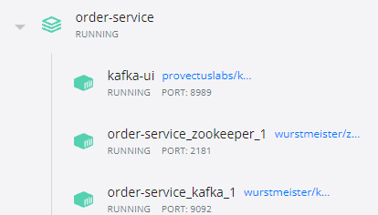

---
* docker compose는 편하다.
  * 2개 이상의 컨테이너를 같이 사용하는 경우에, docker CLI를 이용해서 개별 컨테이너를 일일이 설정하는 것은 귀찮다.
  * network 관련 설정을 하지 않아도 default로 네트워크를 하나 잡아준다.


| docker CLI command | docker compose command |
|---|---|
| docker run myimage | docker-compose up |
| docker build  | docker-compose up --build  |
| docker run myimage  |  |
| docker run -d  | docker-compose up -d |
| docker stop <container-id>  |  docker-compose down  |

* 파일 지정하는 경우는 아래와 같이 -f 옵션을 준다. **-f가 up이나 down같은 명령보다 앞에 나와야 한다.**
```
docker-compose -f compose-3.yml up
```

* 소스를 빌드해서 이미지를 생성하는 경우에는 소스가 수정되면 --build 옵션을 이용해야 적용된다.
  * docker-compose up --build
  * --build는 up 뒤에 나와야 한다.

* restart policy

컨테이너를 다시 재기동하는 조건을 설정

| docker CLI command | docker compose command |
|---|---|
| "no"  | Never attempt to restart this. container if it stops or crashes.  |
| always | If this container stops "for any reason" always attemp to restart it |
| on-failure | Only restart if the container stops with an error code |
| unless-stopped | Always restart unless we (the developers) focibly stop it |


yml 파일에서 no는 false를 의미하기 때문에 ' 이나 "으로 싸줘야 한다.


* docker CLI와 비슷한 명령
  * docker-compose ps
    * docker ps와 비슷함. docker-compose.yml파일에서 컨테이너정보를 얻어옴.


# docker-compose 기본 명령

 * docker-compose.yml is default filename.
 * You can specify filename with docker-compose -f


 * setup volumes/networks and start all containers
   * docker-compose up
   * to deamonize use with -d
 * stop all container and remove cont/vol/net
   * docker-compose down
   * to delete volumes use with docker-compose down -v

 * build image
   * docker-compose build
   * easy to use locally
   * Great for compolex builds that have lots of vars or build args


 * List Container
   * docker-compose ps

 * log with timestamp
   * docker-compose logs -t {comtainer}


---
# Examples

 * ComposeExample01
   * simple examples

 * ComposeExample02
   * traffics through nginx server as proxy, apache server responds.

 * ComposeExample03
   * use ngnix as proxy (using nginx.Dockerfile), and make local image nginx-custom
   * modify boost template  on host, You can see modification allied on browser.
   * 이미지가 compose-sample-3_proxy같이 directory path를 참고해서 만들어진다. 이 이미지들을 지우기 위해서는 아래 명령을 실행할 것.
     * docker-compose down --rmi local

 * ComposeExample04
   * Build a basic compose for a Drupal content management system website(using dockerhub).
   * Use the drupal image along with the postgres image
   * Use ports to expose Drupal on 8080 so you can localhost:8080
   * Be sure to set POSTGRES_PASSWORD for postgres
   * Walk though Drupal  setup via browser
   * Tip: Drupal assumes DB is localhost, but it's service name
   * Use volumes to store Drupal unique data

 * ComposeExample05
   * Building custom drupal image for local testing
   * Make your Dockerfile and docker-compose.yml in dir ComposeExample05
   * Use the drupla image along with the postgres image as before
   * Use README.md in that dir for details


---
# docker-compose

### 파일 이름 지정 -f
 * default filename은 docker-compose.yml 이나 docker-compose.yaml 이다.


### up down
 * up   파일에 정의되있는 모든 컨테이너를 생성하고 시작한다
 * down 파일에 정의되있는 모든 컨테이너를 중지하고 삭제한다

 * setup volumes/networks and start all containers
   * docker-compose up
   * to deamonize use with -d
 * stop all container and remove cont/vol/net
   * docker-compose down
   * to delete volumes use with docker-compose down -v

### start stop
 * 생성되있는 컨테이너를 시작/정지


### build
 * 이미지 생성

 * docker-compose build
 * easy to use locally
 * Great for compolex builds that have lots of vars or build args


### ps
 * List Container
   * docker-compose ps

### logs
 * log with timestamp
   * docker-compose logs -t {comtainer}


---
# 같은 디렉토리에 여러 docker-compose파일을 가지고 있는 경우
You can run the services in multiple docker-compose files using parameter -p
```
-p, --project-name NAME
```

So, the following command should work:

 * docker-compose -f ./docker-compose-new.yml -p new_project_name up -d




같은 디렉토리에 2개의 독립적으로 동작하는 컨테이너들을 기동시키는 경우, 디렉토리명으로 이름이 겹쳐서, 위의 그림처럼 관리하기 어려워지는데,

-p 옵션으로 다른 이름을 주어서 해결할 수 있다.

혹은, 일부러 같은 디렉토리에 위치 시킨 경우에는 아래처럼 명령을 실행할 수 있다.

 * docker-compose -f docker-compose1.yml -f docker-compose2.yml up --build


